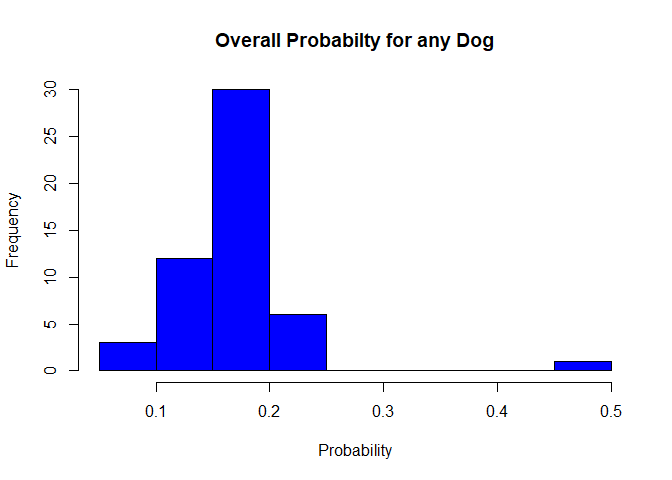

# Thor, The Rhodesian Ridgeback. Dog of Thunder!

## Project Intro

We show my dog, Thor, the Rhodesian Ridgeback in conformation. I would
like to know the probability of him winning at any event. Does he have a
better chance than other dogs? Once I have his overall probability, I
will check what his probability is if the event is outside versus
inside. Or if he has a male judge versus a female judge. And combining
those, does he do better with a male or female judge when he is inside
or outside?

## Why I Chose this

I think it would be fun to try and predict if he will win an event that
is very subjective. Winning very much depends on the specific dogs that
are entered, as well as each judge that is judging. However, since we
show locally, we do show against primarily the same dogs for each event.

## How

We have historical data that shows how many times he has won (gets Best
of Breed) against a given number of dogs. Data would look like: Event1,
5 dogs entered: Result = Lost Event2, 6 dogs entered: Result = Won Thor
obviously has the best probability of winning when he is the only dog.

# Body

## Brief introduction of Dog Shows

A little background about confirmation dog shows. Confirmation compares
each dog to how well they conform to the standard of their particular
breed. If you are interested, [Rhodesian Ridgeback Standard can be found
by clicking
here](https://images.akc.org/pdf/breeds/standards/RhodesianRidgeback.pdf)

The judging is done by breed. For each breed, dogs are always separated
by Male (Dogs) and Female (Bitches). Then after that, they are separated
into classes (various puppy classes by age, Bred-by exhibitor, open,
etc) to determine the best in each class. Each class is judged
separately, but then the winners from each class go into the ring again
to decide Winner’s Dog or Winner’s Bitch. For each event, once all the
class dogs and winners have competed, the Winner’s Dog and Winner’s
Bitch go into the ring with all of the Specials (dogs that have
previously earned their championship). A dog earns points based on the
number of other dogs they beat in the class. Once they have accumulated
25 points (with other stipulations), they become a “Champion” or
“Special”. These dogs then compete for Best of Breed. There are other
awards they can get at this time as well, but the Best of Breed (BOB)
winner goes on to the group ring to compete against other BOB winners in
the same group (Hound, Working, Sporting, Non-Sporting, Toy, Terrier,
and herding). Then the 1st place winner of each of those groups then
compete for Best in Show.

For Thor (his full kennel name is **GCHB CH Hilltop’s Conquering The
World**), he has earned his Bronze Grand Championship. His breed,
Rhodesion Ridgeback, is in the hound group.

## Data I selected:

For the data, I am only pulling it from when he first became a champion
and competed in the Best of Breed class. I have also only counted a WIN
as when he was awarded a Best of Breed, although he has earned other
awards while in the Best of Breed ring (Best of Opposite Sex, Select
Dog, etc). I also did not include any wins he got in the group ring or
in the Best of Show rings.

## Collecting Data and bringing it into R

I have been manually collecting data in Excel since we started showing
dogs (I have always been a data nerd!). So I did parse down the data as
explained above and saved it into an Excel file. Then I used the
commands below to bring it into R.

First I installed the readxl package, and then called that package to
use it.

install.packages(“readxl”)

    library("readxl")

Then brought in the data:

    Thor_Data <- read_excel("Thor Data.xlsx")

I found this instruction on the following website:

[Importing Excel Files into R using readxl
package](http://www.sthda.com/english/wiki/reading-data-from-excel-files-xls-xlsx-into-r)

Here are some graphs to show the data we are working with: This is a
graph of the overall probability for each event of any dog winning.

For reference, I used this website to customize my histograms, click for
link: [techvidvan.com](https://techvidvan.com/tutorials/histogram-in-r/)

     hist(Thor_Data$`Overall Probability for any dog`, main = "Overall Probabilty for any Dog", 
          breaks = 12, xlab = "Probability", ylab = "Frequency", col = "blue")

 There
looks to be some outliers when there is 2 or less dogs in the event.
(50% chance of winning)

I wanted to also graph how many dogs are entered in the Best of Breed
ring.

    hist(Thor_Data$`Dogs in BOB`, breaks = 12, main = "Total Dogs Entered", xlab = "Dogs", 
         ylab = "Frequency", ylim=c(0,20),col = "yellow")

 So, for
the majority of the shows, there seems to be about 5 dogs entered.

Thor won 12 times out of 52 shows. Is this more or less than the overall
expected value of winning?

Thor’s Probability of winning in 52 events is:

    ProbThorWin <- 12/52
    ProbThorWin

    ## [1] 0.2307692

His probability of winning is about 23%

*H**o*:
Thor wins the same amount of times as any other dog in the competition.
Or ProbThorWin = Expectmean

*H**a*:
Thor wins more times than other dogs. Or ProbThorWin &gt; Expectmean

To determine this, I calculated the Expected number of wins given each
probability for each event.

    ExpectWins <- mean(Thor_Data$`Overall Probability for any dog`)*(dim(Thor_Data)[1])
    ExpectWins

    ## [1] 9.399206

Since the expected wins is approximately 9, and Thor has won 12 times,
he seems to be slightly more probable to win. But I will continue to
test that out.

Any Dog’s Probability of winning in 52 events is:

    ProbAnyWin <- 9/52
    ProbAnyWin

    ## [1] 0.1730769

Any dog’s probability of winning is about 17%, and Thor’s is about 23%,
but let’s continue to test that out.

Calculating Standard Deviation of the probability of each event:

    OverallStd <- sd(Thor_Data$`Overall Probability for any dog`)
    OverallStd

    ## [1] 0.06259883

And the mean:

    ExpectMean <- mean(Thor_Data$`Overall Probability for any dog`)
    ExpectMean

    ## [1] 0.180754

Calculating the z-score:

    ThorzScore <- (ProbThorWin - ExpectMean)/OverallStd
    ThorzScore

    ## [1] 0.7989808

This value shows that Thor’s results are less than one standard
deviation away from the expected wins mean. So, that seems to close to
call. I can not reject the null hypothesis.

Next, I wanted to count the number of times he had a male judge or a
female judge.

    table(Thor_Data$`Judge (M/F)`)

    ## 
    ## Female   Male 
    ##     26     26

Which, I was surprised at the even split. We will determine which he won
with more later.

Also, I wanted to see how many shows where Thor was outside versus
inside.

    table(Thor_Data$`Inside/Outside`)

    ## 
    ##  Inside Outside 
    ##      26      26

I was also surprised at this result. And we will also calculate how
often he won for each as well.

I created a subset of just his wins

    Thor_WinData <- subset(Thor_Data, Thor_Data$`Won (1=Y/0=N)` >= 1)

And then repeated the counts of Judges and Venue location

    table(Thor_WinData$`Judge (M/F)`)

    ## 
    ## Female   Male 
    ##      7      5

    table(Thor_WinData$`Inside/Outside`)

    ## 
    ##  Inside Outside 
    ##       7       5

Interesting that those counts are balanced in the same way.

So it seems that Thor slightly prefers to show to females and prefers to
be inside. But does he win more when both of those are true?

Creating another subset of indoor/outdoor wins.

    Thor_VenueWin <- subset(Thor_WinData, Thor_WinData$`Inside/Outside` =="Inside")

And another count of judges:

    table(Thor_VenueWin$`Judge (M/F)`)

    ## 
    ## Female   Male 
    ##      6      1

So this shows, of his 12 total wins, 7 of them were inside, and 6 of
those were given to him by a female judge.

I can kind of conclude from this that Thor prefers to be inside and
prefers Female judges, in order for him to show his best. Or conversely,
more female judges prefer Thor, and see his movement better when he is
inside. (He is kind of a Big Diva and doesn’t like his feet to be
uncomfortable on grass, not to mention if it is wet grass or it is
raining!)

But let’s look at the probability to verify.

We saw earlier, that Gender of judge or location of event were both
split in half, so their probabilities will all be the same.

    ProbFemale <- 26/52
    ProbFemale

    ## [1] 0.5

    ProbMale <- 26/52
    ProbMale

    ## [1] 0.5

    ProbInside <- 26/52
    ProbInside

    ## [1] 0.5

    ProbOutside <- 26/52
    ProbOutside

    ## [1] 0.5

Using values from above, we can also calculate the conditional
probability of Thor winning under each of those situations

    ProbWinFemale <- 7/52
    ProbWinMale <- 5/52
    ProbWinInside <- 7/52
    ProbWinOutside <- 5/52
    ProbWinFemale

    ## [1] 0.1346154

    ProbWinMale

    ## [1] 0.09615385

    ProbWinInside

    ## [1] 0.1346154

    ProbWinOutside

    ## [1] 0.09615385

Using those numbers as the base numbers, we can now calculate
inside/outside (recall they have the same proportions as male female)

    ProbThorWinFemaleInside <- ProbWinFemale + ProbWinInside
    ProbThorWinFemaleOutside <- ProbWinFemale + ProbWinOutside
    ProbThorWinMaleInside <- ProbWinMale + ProbWinInside
    ProbThorWinMaleOutside <- ProbWinMale + ProbWinOutside
    ProbThorWinFemaleInside

    ## [1] 0.2692308

    ProbThorWinFemaleOutside

    ## [1] 0.2307692

    ProbThorWinMaleInside

    ## [1] 0.2307692

    ProbThorWinMaleOutside

    ## [1] 0.1923077

# Topics From Class

## R Markdown:

I was introduced to R and R Markdown in this class. I like it quite a
bit. I used Juniper Notebooks in my Python class, but that didn’t seem
to have as much functionality, or we didn’t get that far into it. I
explored how to add pictures to my R Markdown and was happy that I was
able to figure that out! Still need to do some more investigation on how
to rotate them or change their size, but I got them to work for this
exercise. I also learned how to customize my histograms. I am learning a
lot by reading everyone else’s projects as well!

## Github:

I very briefly used Github in my Python class as well. But mostly for
pulling down data. We also explored using it for our final group
project, but found it too confusing for many of us who were new to using
it. I suspect that as I continue down my Masters degree, I will be using
Github far more and look forward to learning it. I have had no problem
getting it to work. I do feel that since I had a class in software
engineering and am also familiar with using fat clients when building
upgrades to ERP systems, that has helped me understand the concept of
Github.

## Probabilty:

Probability was obviously the basis of my project. Although, I am still
confused sometimes with probability versus proportions. But I feel like
I have learned a bit more with this project.

## Joint Probabilites:

While I was working on this project, I went back to the book, and
reviewed Joint Probabilities. I created a table for myself to help check
my answers. I was trying to figure out how, without just uploading the
data, to get it into R Markdown, but have not succeeded in that yet. But
I was glad that my answers were matching my table!

## Conditional Probabilities:

Again, going to the book to confirm what I was calculating, I reviewed
Conditional Probabilities that shows the outcome A (Thor Winning) give
Condition B (Female Judge). Then I took that a step farther, and said
the outcome of Thor winning with a female judge, given the event is
inside.

# Conclusion

With this data, it looks like we should choose shows where Thor can show
to a female judge while showing indoors. This is very interesting data
to have. It costs about $100 a weekend of showing (2 shows), plus travel
expenses, grooming spaces, food, etc and of course, time. So if we can
narrow it down to shows with this criteria, we can better use our money
to continue to win with Thor. However, the data is really too close to
make any hard and fast rules on what to do. Probably proving that it is
very subjective!

I did learn a lot with this project, but I struggle with knowing when to
use what equations, and how to get them to function in R. I do find R to
be very useful though. I want to explore it more. We used SAS and
Tableau in other classes and those were both very robust programs that
are harder to understand.

I also took initial feedback from Nolan Sawchuk and added in information
on the expected # of wins to see if that was helpful. And added graphs
per Donna Weber’s and Sarah Presse’s suggestions. Ellie Byler gave me
the great tip on making sure my url’s showed up in BLUE in my PDF.

# Appendix 1: Full Data Set

How to do this was found here: [Printing a Dataframe in R
Markdown](https://stackoverflow.com/questions/61407548/rmarkdown-printing-a-dataframe)

<table style="width:100%;">
<colgroup>
<col style="width: 1%" />
<col style="width: 5%" />
<col style="width: 6%" />
<col style="width: 5%" />
<col style="width: 6%" />
<col style="width: 5%" />
<col style="width: 6%" />
<col style="width: 5%" />
<col style="width: 7%" />
<col style="width: 5%" />
<col style="width: 6%" />
<col style="width: 7%" />
<col style="width: 2%" />
<col style="width: 3%" />
<col style="width: 9%" />
<col style="width: 14%" />
</colgroup>
<thead>
<tr class="header">
<th style="text-align: left;"></th>
<th style="text-align: left;">Date</th>
<th style="text-align: left;">Inside/Outside</th>
<th style="text-align: left;">Judge (M/F)</th>
<th style="text-align: left;"># in his Class</th>
<th style="text-align: right;">Class Dogs</th>
<th style="text-align: right;">Class Bitches</th>
<th style="text-align: right;">Special Dog</th>
<th style="text-align: right;">Special Bitches</th>
<th style="text-align: right;">Dogs in BOB</th>
<th style="text-align: right;">Won (1=Y/0=N)</th>
<th style="text-align: right;">TOTAL DOGS Beat</th>
<th style="text-align: right;">Dogs</th>
<th style="text-align: right;">Bitches</th>
<th style="text-align: right;">Thor P(A) Each Event</th>
<th style="text-align: right;">Overall Probability for any dog</th>
</tr>
</thead>
<tbody>
<tr class="odd">
<td style="text-align: left;">1</td>
<td style="text-align: left;">2018-06-21</td>
<td style="text-align: left;">Outside</td>
<td style="text-align: left;">Male</td>
<td style="text-align: left;">NA</td>
<td style="text-align: right;">4</td>
<td style="text-align: right;">5</td>
<td style="text-align: right;">4</td>
<td style="text-align: right;">0</td>
<td style="text-align: right;">6</td>
<td style="text-align: right;">1</td>
<td style="text-align: right;">5</td>
<td style="text-align: right;">5</td>
<td style="text-align: right;">1</td>
<td style="text-align: right;">0.1666667</td>
<td style="text-align: right;">0.1666667</td>
</tr>
<tr class="even">
<td style="text-align: left;">2</td>
<td style="text-align: left;">2018-06-22</td>
<td style="text-align: left;">Outside</td>
<td style="text-align: left;">Male</td>
<td style="text-align: left;">NA</td>
<td style="text-align: right;">5</td>
<td style="text-align: right;">7</td>
<td style="text-align: right;">5</td>
<td style="text-align: right;">1</td>
<td style="text-align: right;">8</td>
<td style="text-align: right;">0</td>
<td style="text-align: right;">0</td>
<td style="text-align: right;">6</td>
<td style="text-align: right;">2</td>
<td style="text-align: right;">0.0000000</td>
<td style="text-align: right;">0.1250000</td>
</tr>
<tr class="odd">
<td style="text-align: left;">3</td>
<td style="text-align: left;">2018-06-23</td>
<td style="text-align: left;">Outside</td>
<td style="text-align: left;">Male</td>
<td style="text-align: left;">NA</td>
<td style="text-align: right;">4</td>
<td style="text-align: right;">9</td>
<td style="text-align: right;">6</td>
<td style="text-align: right;">1</td>
<td style="text-align: right;">9</td>
<td style="text-align: right;">0</td>
<td style="text-align: right;">0</td>
<td style="text-align: right;">7</td>
<td style="text-align: right;">2</td>
<td style="text-align: right;">0.0000000</td>
<td style="text-align: right;">0.1111111</td>
</tr>
<tr class="even">
<td style="text-align: left;">4</td>
<td style="text-align: left;">2018-06-24</td>
<td style="text-align: left;">Outside</td>
<td style="text-align: left;">Female</td>
<td style="text-align: left;">NA</td>
<td style="text-align: right;">4</td>
<td style="text-align: right;">9</td>
<td style="text-align: right;">6</td>
<td style="text-align: right;">0</td>
<td style="text-align: right;">8</td>
<td style="text-align: right;">0</td>
<td style="text-align: right;">0</td>
<td style="text-align: right;">7</td>
<td style="text-align: right;">1</td>
<td style="text-align: right;">0.0000000</td>
<td style="text-align: right;">0.1250000</td>
</tr>
<tr class="odd">
<td style="text-align: left;">5</td>
<td style="text-align: left;">2018-08-11</td>
<td style="text-align: left;">Inside</td>
<td style="text-align: left;">Female</td>
<td style="text-align: left;">NA</td>
<td style="text-align: right;">2</td>
<td style="text-align: right;">2</td>
<td style="text-align: right;">3</td>
<td style="text-align: right;">1</td>
<td style="text-align: right;">6</td>
<td style="text-align: right;">0</td>
<td style="text-align: right;">0</td>
<td style="text-align: right;">4</td>
<td style="text-align: right;">2</td>
<td style="text-align: right;">0.0000000</td>
<td style="text-align: right;">0.1666667</td>
</tr>
<tr class="even">
<td style="text-align: left;">6</td>
<td style="text-align: left;">2018-08-12</td>
<td style="text-align: left;">Inside</td>
<td style="text-align: left;">Male</td>
<td style="text-align: left;">NA</td>
<td style="text-align: right;">2</td>
<td style="text-align: right;">2</td>
<td style="text-align: right;">3</td>
<td style="text-align: right;">1</td>
<td style="text-align: right;">6</td>
<td style="text-align: right;">0</td>
<td style="text-align: right;">0</td>
<td style="text-align: right;">4</td>
<td style="text-align: right;">2</td>
<td style="text-align: right;">0.0000000</td>
<td style="text-align: right;">0.1666667</td>
</tr>
<tr class="odd">
<td style="text-align: left;">7</td>
<td style="text-align: left;">2018-08-25</td>
<td style="text-align: left;">Outside</td>
<td style="text-align: left;">Female</td>
<td style="text-align: left;">NA</td>
<td style="text-align: right;">4</td>
<td style="text-align: right;">3</td>
<td style="text-align: right;">1</td>
<td style="text-align: right;">2</td>
<td style="text-align: right;">5</td>
<td style="text-align: right;">0</td>
<td style="text-align: right;">0</td>
<td style="text-align: right;">2</td>
<td style="text-align: right;">3</td>
<td style="text-align: right;">0.0000000</td>
<td style="text-align: right;">0.2000000</td>
</tr>
<tr class="even">
<td style="text-align: left;">8</td>
<td style="text-align: left;">2018-08-26</td>
<td style="text-align: left;">Outside</td>
<td style="text-align: left;">Male</td>
<td style="text-align: left;">NA</td>
<td style="text-align: right;">2</td>
<td style="text-align: right;">3</td>
<td style="text-align: right;">1</td>
<td style="text-align: right;">2</td>
<td style="text-align: right;">5</td>
<td style="text-align: right;">0</td>
<td style="text-align: right;">0</td>
<td style="text-align: right;">2</td>
<td style="text-align: right;">3</td>
<td style="text-align: right;">0.0000000</td>
<td style="text-align: right;">0.2000000</td>
</tr>
<tr class="odd">
<td style="text-align: left;">9</td>
<td style="text-align: left;">2018-11-17</td>
<td style="text-align: left;">Inside</td>
<td style="text-align: left;">Female</td>
<td style="text-align: left;">NA</td>
<td style="text-align: right;">1</td>
<td style="text-align: right;">2</td>
<td style="text-align: right;">3</td>
<td style="text-align: right;">0</td>
<td style="text-align: right;">5</td>
<td style="text-align: right;">1</td>
<td style="text-align: right;">4</td>
<td style="text-align: right;">4</td>
<td style="text-align: right;">1</td>
<td style="text-align: right;">0.2000000</td>
<td style="text-align: right;">0.2000000</td>
</tr>
<tr class="even">
<td style="text-align: left;">10</td>
<td style="text-align: left;">2018-11-18</td>
<td style="text-align: left;">Inside</td>
<td style="text-align: left;">Male</td>
<td style="text-align: left;">NA</td>
<td style="text-align: right;">1</td>
<td style="text-align: right;">2</td>
<td style="text-align: right;">3</td>
<td style="text-align: right;">1</td>
<td style="text-align: right;">6</td>
<td style="text-align: right;">0</td>
<td style="text-align: right;">0</td>
<td style="text-align: right;">4</td>
<td style="text-align: right;">2</td>
<td style="text-align: right;">0.0000000</td>
<td style="text-align: right;">0.1666667</td>
</tr>
<tr class="odd">
<td style="text-align: left;">11</td>
<td style="text-align: left;">2018-12-15</td>
<td style="text-align: left;">Inside</td>
<td style="text-align: left;">Female</td>
<td style="text-align: left;">NA</td>
<td style="text-align: right;">2</td>
<td style="text-align: right;">2</td>
<td style="text-align: right;">3</td>
<td style="text-align: right;">1</td>
<td style="text-align: right;">6</td>
<td style="text-align: right;">0</td>
<td style="text-align: right;">0</td>
<td style="text-align: right;">4</td>
<td style="text-align: right;">2</td>
<td style="text-align: right;">0.0000000</td>
<td style="text-align: right;">0.1666667</td>
</tr>
<tr class="even">
<td style="text-align: left;">12</td>
<td style="text-align: left;">2018-12-16</td>
<td style="text-align: left;">Inside</td>
<td style="text-align: left;">Male</td>
<td style="text-align: left;">NA</td>
<td style="text-align: right;">3</td>
<td style="text-align: right;">1</td>
<td style="text-align: right;">2</td>
<td style="text-align: right;">1</td>
<td style="text-align: right;">5</td>
<td style="text-align: right;">0</td>
<td style="text-align: right;">0</td>
<td style="text-align: right;">3</td>
<td style="text-align: right;">2</td>
<td style="text-align: right;">0.0000000</td>
<td style="text-align: right;">0.2000000</td>
</tr>
<tr class="odd">
<td style="text-align: left;">13</td>
<td style="text-align: left;">2019-01-05</td>
<td style="text-align: left;">Inside</td>
<td style="text-align: left;">Female</td>
<td style="text-align: left;">NA</td>
<td style="text-align: right;">4</td>
<td style="text-align: right;">4</td>
<td style="text-align: right;">3</td>
<td style="text-align: right;">2</td>
<td style="text-align: right;">7</td>
<td style="text-align: right;">0</td>
<td style="text-align: right;">0</td>
<td style="text-align: right;">4</td>
<td style="text-align: right;">3</td>
<td style="text-align: right;">0.0000000</td>
<td style="text-align: right;">0.1428571</td>
</tr>
<tr class="even">
<td style="text-align: left;">14</td>
<td style="text-align: left;">2019-01-06</td>
<td style="text-align: left;">Inside</td>
<td style="text-align: left;">Female</td>
<td style="text-align: left;">NA</td>
<td style="text-align: right;">4</td>
<td style="text-align: right;">4</td>
<td style="text-align: right;">3</td>
<td style="text-align: right;">2</td>
<td style="text-align: right;">7</td>
<td style="text-align: right;">0</td>
<td style="text-align: right;">0</td>
<td style="text-align: right;">4</td>
<td style="text-align: right;">3</td>
<td style="text-align: right;">0.0000000</td>
<td style="text-align: right;">0.1428571</td>
</tr>
<tr class="odd">
<td style="text-align: left;">15</td>
<td style="text-align: left;">2019-05-11</td>
<td style="text-align: left;">Outside</td>
<td style="text-align: left;">Female</td>
<td style="text-align: left;">NA</td>
<td style="text-align: right;">2</td>
<td style="text-align: right;">2</td>
<td style="text-align: right;">2</td>
<td style="text-align: right;">1</td>
<td style="text-align: right;">5</td>
<td style="text-align: right;">0</td>
<td style="text-align: right;">0</td>
<td style="text-align: right;">3</td>
<td style="text-align: right;">2</td>
<td style="text-align: right;">0.0000000</td>
<td style="text-align: right;">0.2000000</td>
</tr>
<tr class="even">
<td style="text-align: left;">16</td>
<td style="text-align: left;">2019-05-12</td>
<td style="text-align: left;">Outside</td>
<td style="text-align: left;">Male</td>
<td style="text-align: left;">NA</td>
<td style="text-align: right;">2</td>
<td style="text-align: right;">2</td>
<td style="text-align: right;">1</td>
<td style="text-align: right;">1</td>
<td style="text-align: right;">4</td>
<td style="text-align: right;">1</td>
<td style="text-align: right;">3</td>
<td style="text-align: right;">2</td>
<td style="text-align: right;">2</td>
<td style="text-align: right;">0.2500000</td>
<td style="text-align: right;">0.2500000</td>
</tr>
<tr class="odd">
<td style="text-align: left;">17</td>
<td style="text-align: left;">2019-05-25</td>
<td style="text-align: left;">Outside</td>
<td style="text-align: left;">Male</td>
<td style="text-align: left;">NA</td>
<td style="text-align: right;">2</td>
<td style="text-align: right;">1</td>
<td style="text-align: right;">3</td>
<td style="text-align: right;">1</td>
<td style="text-align: right;">6</td>
<td style="text-align: right;">0</td>
<td style="text-align: right;">0</td>
<td style="text-align: right;">4</td>
<td style="text-align: right;">2</td>
<td style="text-align: right;">0.0000000</td>
<td style="text-align: right;">0.1666667</td>
</tr>
<tr class="even">
<td style="text-align: left;">18</td>
<td style="text-align: left;">2019-05-26</td>
<td style="text-align: left;">Outside</td>
<td style="text-align: left;">Male</td>
<td style="text-align: left;">NA</td>
<td style="text-align: right;">2</td>
<td style="text-align: right;">1</td>
<td style="text-align: right;">3</td>
<td style="text-align: right;">1</td>
<td style="text-align: right;">6</td>
<td style="text-align: right;">0</td>
<td style="text-align: right;">0</td>
<td style="text-align: right;">4</td>
<td style="text-align: right;">2</td>
<td style="text-align: right;">0.0000000</td>
<td style="text-align: right;">0.1666667</td>
</tr>
<tr class="odd">
<td style="text-align: left;">19</td>
<td style="text-align: left;">2019-06-08</td>
<td style="text-align: left;">Outside</td>
<td style="text-align: left;">Female</td>
<td style="text-align: left;">NA</td>
<td style="text-align: right;">2</td>
<td style="text-align: right;">1</td>
<td style="text-align: right;">1</td>
<td style="text-align: right;">1</td>
<td style="text-align: right;">4</td>
<td style="text-align: right;">1</td>
<td style="text-align: right;">3</td>
<td style="text-align: right;">2</td>
<td style="text-align: right;">2</td>
<td style="text-align: right;">0.2500000</td>
<td style="text-align: right;">0.2500000</td>
</tr>
<tr class="even">
<td style="text-align: left;">20</td>
<td style="text-align: left;">2019-06-09</td>
<td style="text-align: left;">Outside</td>
<td style="text-align: left;">Female</td>
<td style="text-align: left;">NA</td>
<td style="text-align: right;">2</td>
<td style="text-align: right;">1</td>
<td style="text-align: right;">1</td>
<td style="text-align: right;">1</td>
<td style="text-align: right;">4</td>
<td style="text-align: right;">0</td>
<td style="text-align: right;">0</td>
<td style="text-align: right;">2</td>
<td style="text-align: right;">2</td>
<td style="text-align: right;">0.0000000</td>
<td style="text-align: right;">0.2500000</td>
</tr>
<tr class="odd">
<td style="text-align: left;">21</td>
<td style="text-align: left;">2019-06-20</td>
<td style="text-align: left;">Outside</td>
<td style="text-align: left;">Male</td>
<td style="text-align: left;">NA</td>
<td style="text-align: right;">3</td>
<td style="text-align: right;">4</td>
<td style="text-align: right;">4</td>
<td style="text-align: right;">3</td>
<td style="text-align: right;">9</td>
<td style="text-align: right;">0</td>
<td style="text-align: right;">0</td>
<td style="text-align: right;">5</td>
<td style="text-align: right;">4</td>
<td style="text-align: right;">0.0000000</td>
<td style="text-align: right;">0.1111111</td>
</tr>
<tr class="even">
<td style="text-align: left;">22</td>
<td style="text-align: left;">2019-06-21</td>
<td style="text-align: left;">Outside</td>
<td style="text-align: left;">Female</td>
<td style="text-align: left;">NA</td>
<td style="text-align: right;">3</td>
<td style="text-align: right;">7</td>
<td style="text-align: right;">5</td>
<td style="text-align: right;">5</td>
<td style="text-align: right;">12</td>
<td style="text-align: right;">0</td>
<td style="text-align: right;">0</td>
<td style="text-align: right;">6</td>
<td style="text-align: right;">6</td>
<td style="text-align: right;">0.0000000</td>
<td style="text-align: right;">0.0833333</td>
</tr>
<tr class="odd">
<td style="text-align: left;">23</td>
<td style="text-align: left;">2019-06-22</td>
<td style="text-align: left;">Outside</td>
<td style="text-align: left;">Male</td>
<td style="text-align: left;">NA</td>
<td style="text-align: right;">4</td>
<td style="text-align: right;">8</td>
<td style="text-align: right;">5</td>
<td style="text-align: right;">3</td>
<td style="text-align: right;">10</td>
<td style="text-align: right;">0</td>
<td style="text-align: right;">0</td>
<td style="text-align: right;">6</td>
<td style="text-align: right;">4</td>
<td style="text-align: right;">0.0000000</td>
<td style="text-align: right;">0.1000000</td>
</tr>
<tr class="even">
<td style="text-align: left;">24</td>
<td style="text-align: left;">2019-06-23</td>
<td style="text-align: left;">Outside</td>
<td style="text-align: left;">Male</td>
<td style="text-align: left;">NA</td>
<td style="text-align: right;">4</td>
<td style="text-align: right;">4</td>
<td style="text-align: right;">4</td>
<td style="text-align: right;">3</td>
<td style="text-align: right;">9</td>
<td style="text-align: right;">0</td>
<td style="text-align: right;">0</td>
<td style="text-align: right;">5</td>
<td style="text-align: right;">4</td>
<td style="text-align: right;">0.0000000</td>
<td style="text-align: right;">0.1111111</td>
</tr>
<tr class="odd">
<td style="text-align: left;">25</td>
<td style="text-align: left;">2019-07-11</td>
<td style="text-align: left;">Inside</td>
<td style="text-align: left;">Female</td>
<td style="text-align: left;">NA</td>
<td style="text-align: right;">1</td>
<td style="text-align: right;">0</td>
<td style="text-align: right;">3</td>
<td style="text-align: right;">1</td>
<td style="text-align: right;">5</td>
<td style="text-align: right;">0</td>
<td style="text-align: right;">0</td>
<td style="text-align: right;">4</td>
<td style="text-align: right;">1</td>
<td style="text-align: right;">0.0000000</td>
<td style="text-align: right;">0.2000000</td>
</tr>
<tr class="even">
<td style="text-align: left;">26</td>
<td style="text-align: left;">2019-07-12</td>
<td style="text-align: left;">Inside</td>
<td style="text-align: left;">Male</td>
<td style="text-align: left;">NA</td>
<td style="text-align: right;">2</td>
<td style="text-align: right;">0</td>
<td style="text-align: right;">2</td>
<td style="text-align: right;">1</td>
<td style="text-align: right;">4</td>
<td style="text-align: right;">1</td>
<td style="text-align: right;">3</td>
<td style="text-align: right;">3</td>
<td style="text-align: right;">1</td>
<td style="text-align: right;">0.2500000</td>
<td style="text-align: right;">0.2500000</td>
</tr>
<tr class="odd">
<td style="text-align: left;">27</td>
<td style="text-align: left;">2019-07-13</td>
<td style="text-align: left;">Inside</td>
<td style="text-align: left;">Female</td>
<td style="text-align: left;">NA</td>
<td style="text-align: right;">2</td>
<td style="text-align: right;">0</td>
<td style="text-align: right;">3</td>
<td style="text-align: right;">1</td>
<td style="text-align: right;">5</td>
<td style="text-align: right;">1</td>
<td style="text-align: right;">4</td>
<td style="text-align: right;">4</td>
<td style="text-align: right;">1</td>
<td style="text-align: right;">0.2000000</td>
<td style="text-align: right;">0.2000000</td>
</tr>
<tr class="even">
<td style="text-align: left;">28</td>
<td style="text-align: left;">2019-07-14</td>
<td style="text-align: left;">Inside</td>
<td style="text-align: left;">Male</td>
<td style="text-align: left;">NA</td>
<td style="text-align: right;">2</td>
<td style="text-align: right;">0</td>
<td style="text-align: right;">2</td>
<td style="text-align: right;">1</td>
<td style="text-align: right;">4</td>
<td style="text-align: right;">0</td>
<td style="text-align: right;">0</td>
<td style="text-align: right;">3</td>
<td style="text-align: right;">1</td>
<td style="text-align: right;">0.0000000</td>
<td style="text-align: right;">0.2500000</td>
</tr>
<tr class="odd">
<td style="text-align: left;">29</td>
<td style="text-align: left;">2019-08-24</td>
<td style="text-align: left;">Outside</td>
<td style="text-align: left;">Male</td>
<td style="text-align: left;">NA</td>
<td style="text-align: right;">6</td>
<td style="text-align: right;">4</td>
<td style="text-align: right;">5</td>
<td style="text-align: right;">3</td>
<td style="text-align: right;">10</td>
<td style="text-align: right;">1</td>
<td style="text-align: right;">9</td>
<td style="text-align: right;">6</td>
<td style="text-align: right;">4</td>
<td style="text-align: right;">0.1000000</td>
<td style="text-align: right;">0.1000000</td>
</tr>
<tr class="even">
<td style="text-align: left;">30</td>
<td style="text-align: left;">2019-08-25</td>
<td style="text-align: left;">Outside</td>
<td style="text-align: left;">Male</td>
<td style="text-align: left;">NA</td>
<td style="text-align: right;">4</td>
<td style="text-align: right;">3</td>
<td style="text-align: right;">4</td>
<td style="text-align: right;">3</td>
<td style="text-align: right;">9</td>
<td style="text-align: right;">0</td>
<td style="text-align: right;">0</td>
<td style="text-align: right;">5</td>
<td style="text-align: right;">4</td>
<td style="text-align: right;">0.0000000</td>
<td style="text-align: right;">0.1111111</td>
</tr>
<tr class="odd">
<td style="text-align: left;">31</td>
<td style="text-align: left;">2019-11-23</td>
<td style="text-align: left;">Inside</td>
<td style="text-align: left;">Female</td>
<td style="text-align: left;">NA</td>
<td style="text-align: right;">4</td>
<td style="text-align: right;">3</td>
<td style="text-align: right;">2</td>
<td style="text-align: right;">2</td>
<td style="text-align: right;">6</td>
<td style="text-align: right;">0</td>
<td style="text-align: right;">0</td>
<td style="text-align: right;">3</td>
<td style="text-align: right;">3</td>
<td style="text-align: right;">0.0000000</td>
<td style="text-align: right;">0.1666667</td>
</tr>
<tr class="even">
<td style="text-align: left;">32</td>
<td style="text-align: left;">2019-11-24</td>
<td style="text-align: left;">Inside</td>
<td style="text-align: left;">Female</td>
<td style="text-align: left;">NA</td>
<td style="text-align: right;">4</td>
<td style="text-align: right;">3</td>
<td style="text-align: right;">2</td>
<td style="text-align: right;">2</td>
<td style="text-align: right;">6</td>
<td style="text-align: right;">0</td>
<td style="text-align: right;">0</td>
<td style="text-align: right;">3</td>
<td style="text-align: right;">3</td>
<td style="text-align: right;">0.0000000</td>
<td style="text-align: right;">0.1666667</td>
</tr>
<tr class="odd">
<td style="text-align: left;">33</td>
<td style="text-align: left;">2019-12-14</td>
<td style="text-align: left;">Inside</td>
<td style="text-align: left;">Female</td>
<td style="text-align: left;">NA</td>
<td style="text-align: right;">1</td>
<td style="text-align: right;">0</td>
<td style="text-align: right;">1</td>
<td style="text-align: right;">0</td>
<td style="text-align: right;">2</td>
<td style="text-align: right;">0</td>
<td style="text-align: right;">0</td>
<td style="text-align: right;">2</td>
<td style="text-align: right;">0</td>
<td style="text-align: right;">0.0000000</td>
<td style="text-align: right;">0.5000000</td>
</tr>
<tr class="even">
<td style="text-align: left;">34</td>
<td style="text-align: left;">2019-12-15</td>
<td style="text-align: left;">Inside</td>
<td style="text-align: left;">Female</td>
<td style="text-align: left;">NA</td>
<td style="text-align: right;">1</td>
<td style="text-align: right;">1</td>
<td style="text-align: right;">1</td>
<td style="text-align: right;">2</td>
<td style="text-align: right;">5</td>
<td style="text-align: right;">1</td>
<td style="text-align: right;">4</td>
<td style="text-align: right;">2</td>
<td style="text-align: right;">3</td>
<td style="text-align: right;">0.2000000</td>
<td style="text-align: right;">0.2000000</td>
</tr>
<tr class="odd">
<td style="text-align: left;">35</td>
<td style="text-align: left;">2020-01-04</td>
<td style="text-align: left;">Inside</td>
<td style="text-align: left;">Female</td>
<td style="text-align: left;">NA</td>
<td style="text-align: right;">6</td>
<td style="text-align: right;">7</td>
<td style="text-align: right;">3</td>
<td style="text-align: right;">2</td>
<td style="text-align: right;">7</td>
<td style="text-align: right;">0</td>
<td style="text-align: right;">0</td>
<td style="text-align: right;">4</td>
<td style="text-align: right;">3</td>
<td style="text-align: right;">0.0000000</td>
<td style="text-align: right;">0.1428571</td>
</tr>
<tr class="even">
<td style="text-align: left;">36</td>
<td style="text-align: left;">2020-01-05</td>
<td style="text-align: left;">Inside</td>
<td style="text-align: left;">Female</td>
<td style="text-align: left;">NA</td>
<td style="text-align: right;">6</td>
<td style="text-align: right;">6</td>
<td style="text-align: right;">3</td>
<td style="text-align: right;">2</td>
<td style="text-align: right;">7</td>
<td style="text-align: right;">0</td>
<td style="text-align: right;">0</td>
<td style="text-align: right;">4</td>
<td style="text-align: right;">3</td>
<td style="text-align: right;">0.0000000</td>
<td style="text-align: right;">0.1428571</td>
</tr>
<tr class="odd">
<td style="text-align: left;">37</td>
<td style="text-align: left;">2020-10-31</td>
<td style="text-align: left;">Inside</td>
<td style="text-align: left;">Female</td>
<td style="text-align: left;">NA</td>
<td style="text-align: right;">1</td>
<td style="text-align: right;">1</td>
<td style="text-align: right;">2</td>
<td style="text-align: right;">1</td>
<td style="text-align: right;">5</td>
<td style="text-align: right;">1</td>
<td style="text-align: right;">4</td>
<td style="text-align: right;">3</td>
<td style="text-align: right;">2</td>
<td style="text-align: right;">0.2000000</td>
<td style="text-align: right;">0.2000000</td>
</tr>
<tr class="even">
<td style="text-align: left;">38</td>
<td style="text-align: left;">2020-11-01</td>
<td style="text-align: left;">Inside</td>
<td style="text-align: left;">Female</td>
<td style="text-align: left;">NA</td>
<td style="text-align: right;">1</td>
<td style="text-align: right;">1</td>
<td style="text-align: right;">2</td>
<td style="text-align: right;">1</td>
<td style="text-align: right;">5</td>
<td style="text-align: right;">0</td>
<td style="text-align: right;">0</td>
<td style="text-align: right;">3</td>
<td style="text-align: right;">2</td>
<td style="text-align: right;">0.0000000</td>
<td style="text-align: right;">0.2000000</td>
</tr>
<tr class="odd">
<td style="text-align: left;">39</td>
<td style="text-align: left;">2021-05-01</td>
<td style="text-align: left;">Inside</td>
<td style="text-align: left;">Male</td>
<td style="text-align: left;">NA</td>
<td style="text-align: right;">1</td>
<td style="text-align: right;">1</td>
<td style="text-align: right;">3</td>
<td style="text-align: right;">0</td>
<td style="text-align: right;">5</td>
<td style="text-align: right;">0</td>
<td style="text-align: right;">0</td>
<td style="text-align: right;">4</td>
<td style="text-align: right;">1</td>
<td style="text-align: right;">0.0000000</td>
<td style="text-align: right;">0.2000000</td>
</tr>
<tr class="even">
<td style="text-align: left;">40</td>
<td style="text-align: left;">2021-05-02</td>
<td style="text-align: left;">Inside</td>
<td style="text-align: left;">Male</td>
<td style="text-align: left;">NA</td>
<td style="text-align: right;">2</td>
<td style="text-align: right;">1</td>
<td style="text-align: right;">3</td>
<td style="text-align: right;">1</td>
<td style="text-align: right;">6</td>
<td style="text-align: right;">0</td>
<td style="text-align: right;">0</td>
<td style="text-align: right;">4</td>
<td style="text-align: right;">2</td>
<td style="text-align: right;">0.0000000</td>
<td style="text-align: right;">0.1666667</td>
</tr>
<tr class="odd">
<td style="text-align: left;">41</td>
<td style="text-align: left;">2021-06-24</td>
<td style="text-align: left;">Outside</td>
<td style="text-align: left;">Male</td>
<td style="text-align: left;">NA</td>
<td style="text-align: right;">3</td>
<td style="text-align: right;">2</td>
<td style="text-align: right;">2</td>
<td style="text-align: right;">2</td>
<td style="text-align: right;">6</td>
<td style="text-align: right;">0</td>
<td style="text-align: right;">0</td>
<td style="text-align: right;">3</td>
<td style="text-align: right;">3</td>
<td style="text-align: right;">0.0000000</td>
<td style="text-align: right;">0.1666667</td>
</tr>
<tr class="even">
<td style="text-align: left;">42</td>
<td style="text-align: left;">2021-06-25</td>
<td style="text-align: left;">Outside</td>
<td style="text-align: left;">Female</td>
<td style="text-align: left;">NA</td>
<td style="text-align: right;">4</td>
<td style="text-align: right;">2</td>
<td style="text-align: right;">2</td>
<td style="text-align: right;">2</td>
<td style="text-align: right;">6</td>
<td style="text-align: right;">0</td>
<td style="text-align: right;">0</td>
<td style="text-align: right;">3</td>
<td style="text-align: right;">3</td>
<td style="text-align: right;">0.0000000</td>
<td style="text-align: right;">0.1666667</td>
</tr>
<tr class="odd">
<td style="text-align: left;">43</td>
<td style="text-align: left;">2021-06-26</td>
<td style="text-align: left;">Outside</td>
<td style="text-align: left;">Male</td>
<td style="text-align: left;">NA</td>
<td style="text-align: right;">4</td>
<td style="text-align: right;">3</td>
<td style="text-align: right;">4</td>
<td style="text-align: right;">2</td>
<td style="text-align: right;">8</td>
<td style="text-align: right;">0</td>
<td style="text-align: right;">0</td>
<td style="text-align: right;">5</td>
<td style="text-align: right;">3</td>
<td style="text-align: right;">0.0000000</td>
<td style="text-align: right;">0.1250000</td>
</tr>
<tr class="even">
<td style="text-align: left;">44</td>
<td style="text-align: left;">2021-06-27</td>
<td style="text-align: left;">Outside</td>
<td style="text-align: left;">Male</td>
<td style="text-align: left;">NA</td>
<td style="text-align: right;">3</td>
<td style="text-align: right;">8</td>
<td style="text-align: right;">5</td>
<td style="text-align: right;">1</td>
<td style="text-align: right;">8</td>
<td style="text-align: right;">0</td>
<td style="text-align: right;">0</td>
<td style="text-align: right;">6</td>
<td style="text-align: right;">2</td>
<td style="text-align: right;">0.0000000</td>
<td style="text-align: right;">0.1250000</td>
</tr>
<tr class="odd">
<td style="text-align: left;">45</td>
<td style="text-align: left;">2021-07-15</td>
<td style="text-align: left;">Inside</td>
<td style="text-align: left;">Female</td>
<td style="text-align: left;">NA</td>
<td style="text-align: right;">0</td>
<td style="text-align: right;">2</td>
<td style="text-align: right;">3</td>
<td style="text-align: right;">1</td>
<td style="text-align: right;">5</td>
<td style="text-align: right;">1</td>
<td style="text-align: right;">4</td>
<td style="text-align: right;">3</td>
<td style="text-align: right;">2</td>
<td style="text-align: right;">0.2000000</td>
<td style="text-align: right;">0.2000000</td>
</tr>
<tr class="even">
<td style="text-align: left;">46</td>
<td style="text-align: left;">2021-07-16</td>
<td style="text-align: left;">Inside</td>
<td style="text-align: left;">Male</td>
<td style="text-align: left;">NA</td>
<td style="text-align: right;">0</td>
<td style="text-align: right;">3</td>
<td style="text-align: right;">3</td>
<td style="text-align: right;">1</td>
<td style="text-align: right;">5</td>
<td style="text-align: right;">0</td>
<td style="text-align: right;">0</td>
<td style="text-align: right;">3</td>
<td style="text-align: right;">2</td>
<td style="text-align: right;">0.0000000</td>
<td style="text-align: right;">0.2000000</td>
</tr>
<tr class="odd">
<td style="text-align: left;">47</td>
<td style="text-align: left;">2021-07-17</td>
<td style="text-align: left;">Inside</td>
<td style="text-align: left;">Female</td>
<td style="text-align: left;">NA</td>
<td style="text-align: right;">0</td>
<td style="text-align: right;">3</td>
<td style="text-align: right;">3</td>
<td style="text-align: right;">1</td>
<td style="text-align: right;">5</td>
<td style="text-align: right;">0</td>
<td style="text-align: right;">0</td>
<td style="text-align: right;">3</td>
<td style="text-align: right;">2</td>
<td style="text-align: right;">0.0000000</td>
<td style="text-align: right;">0.2000000</td>
</tr>
<tr class="even">
<td style="text-align: left;">48</td>
<td style="text-align: left;">2021-07-18</td>
<td style="text-align: left;">Inside</td>
<td style="text-align: left;">Female</td>
<td style="text-align: left;">NA</td>
<td style="text-align: right;">0</td>
<td style="text-align: right;">2</td>
<td style="text-align: right;">4</td>
<td style="text-align: right;">0</td>
<td style="text-align: right;">5</td>
<td style="text-align: right;">1</td>
<td style="text-align: right;">4</td>
<td style="text-align: right;">4</td>
<td style="text-align: right;">1</td>
<td style="text-align: right;">0.2000000</td>
<td style="text-align: right;">0.2000000</td>
</tr>
<tr class="odd">
<td style="text-align: left;">49</td>
<td style="text-align: left;">2021-08-21</td>
<td style="text-align: left;">Outside</td>
<td style="text-align: left;">Male</td>
<td style="text-align: left;">NA</td>
<td style="text-align: right;">0</td>
<td style="text-align: right;">1</td>
<td style="text-align: right;">4</td>
<td style="text-align: right;">0</td>
<td style="text-align: right;">5</td>
<td style="text-align: right;">0</td>
<td style="text-align: right;">0</td>
<td style="text-align: right;">4</td>
<td style="text-align: right;">1</td>
<td style="text-align: right;">0.0000000</td>
<td style="text-align: right;">0.2000000</td>
</tr>
<tr class="even">
<td style="text-align: left;">50</td>
<td style="text-align: left;">2021-08-22</td>
<td style="text-align: left;">Outside</td>
<td style="text-align: left;">Male</td>
<td style="text-align: left;">NA</td>
<td style="text-align: right;">0</td>
<td style="text-align: right;">0</td>
<td style="text-align: right;">4</td>
<td style="text-align: right;">0</td>
<td style="text-align: right;">4</td>
<td style="text-align: right;">1</td>
<td style="text-align: right;">3</td>
<td style="text-align: right;">4</td>
<td style="text-align: right;">0</td>
<td style="text-align: right;">0.2500000</td>
<td style="text-align: right;">0.2500000</td>
</tr>
<tr class="odd">
<td style="text-align: left;">51</td>
<td style="text-align: left;">2021-08-28</td>
<td style="text-align: left;">Outside</td>
<td style="text-align: left;">Female</td>
<td style="text-align: left;">NA</td>
<td style="text-align: right;">1</td>
<td style="text-align: right;">2</td>
<td style="text-align: right;">3</td>
<td style="text-align: right;">0</td>
<td style="text-align: right;">5</td>
<td style="text-align: right;">0</td>
<td style="text-align: right;">0</td>
<td style="text-align: right;">4</td>
<td style="text-align: right;">1</td>
<td style="text-align: right;">0.0000000</td>
<td style="text-align: right;">0.2000000</td>
</tr>
<tr class="even">
<td style="text-align: left;">52</td>
<td style="text-align: left;">2021-08-29</td>
<td style="text-align: left;">Outside</td>
<td style="text-align: left;">Male</td>
<td style="text-align: left;">NA</td>
<td style="text-align: right;">1</td>
<td style="text-align: right;">2</td>
<td style="text-align: right;">3</td>
<td style="text-align: right;">0</td>
<td style="text-align: right;">5</td>
<td style="text-align: right;">0</td>
<td style="text-align: right;">0</td>
<td style="text-align: right;">4</td>
<td style="text-align: right;">1</td>
<td style="text-align: right;">0.0000000</td>
<td style="text-align: right;">0.2000000</td>
</tr>
</tbody>
</table>

# Appendix 2: Another picture of Thor!

